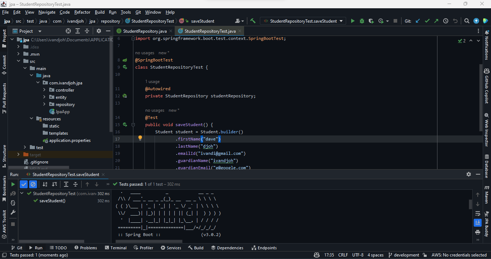
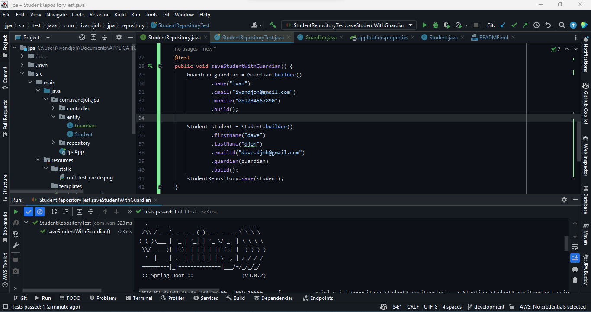

# My JPA

## Description
This is a simple example of a JPA project.

## Technologies

Here are the technologies used in this project.

- Java 11 or higher
- Spring Boot 2.4.4 or higher
- Spring Data JPA
- PostgreSQL 13.2 or higher
- Maven 3.6.3 or higher

## Screenshots

***Unit Test Save Student without Embedded Class***

***Unit Test Save Student with Embedded Class***
